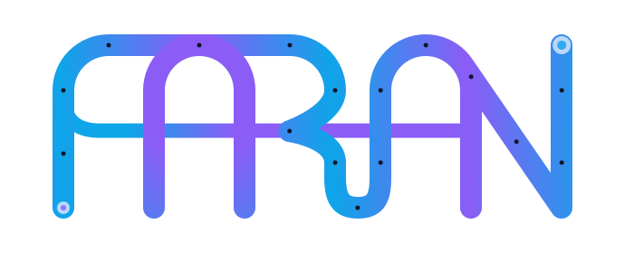

---
hide:
  - navigation
  - toc
---

<div class="hero" markdown="1">

<h1>Composable Trajectory Planning for Python</h1>
<p>Build trajectory planners from modular, interchangeable components. Set up a working pipeline in minutes, then customize as needed.</p>

<div class="hero-buttons" markdown="1">
<a href="guide/getting-started/" class="md-button md-button--primary">Get Started</a>
<a href="guide/examples/" class="md-button">Examples</a>
<a href="https://gitlab.com/risk-metrics/faran" class="md-button">
  :simple-gitlab: Repository
</a>
</div>
</div>

---

## Why Faran?

<div class="grid cards" markdown>

-   :material-puzzle: **Composable**

    ---

    Swap a cost function, sampler, or dynamics model without touching the rest of your pipeline. If two components can logically work together, they will.

-   :material-package-variant-closed: **Comprehensive**

    ---

    Includes everything for a working planner: dynamics models, samplers, state estimation (KF/EKF/UKF), cost functions, obstacle tracking, risk metrics, and motion prediction.

-   :material-swap-horizontal: **Backend-Agnostic**

    ---

    Set up your planner with NumPy, then switch to JAX by changing one import line. Same API, no code rewrite. The shared interface makes it possible to add new backends in the future.

-   :material-test-tube: **Tested**

    ---

    Extensive test suite on both backends. Shape errors are caught early via `jaxtyping` + `beartype` — misconfigured pipelines fail fast with clear messages, not silent wrong results.

</div>

---

## Quick Start

An [MPCC](guide/concepts.md#mpcc-model-predictive-contouring-control) planner tracking a reference path with a [kinematic bicycle model](guide/models.md#kinematic-bicycle-model):

```python
from faran.numpy import mppi, model, sampler, trajectory, types, extract
import numpy as np

reference = trajectory.waypoints(
    points=np.array([[0, 0], [10, 0], [20, 5], [30, 0], [40, -5], [50, 0]]),
    path_length=35.0,
)

planner, augmented_model, contouring_cost, lag_cost = mppi.mpcc(
    model=model.bicycle.dynamical(
        time_step_size=0.1, wheelbase=2.5,
        speed_limits=(0.0, 15.0), steering_limits=(-0.5, 0.5),
        acceleration_limits=(-3.0, 3.0),
    ),
    sampler=sampler.gaussian(
        standard_deviation=np.array([0.5, 0.05]),
        rollout_count=256,
        to_batch=types.bicycle.control_input_batch.create, seed=42,
    ),
    reference=reference,
    position_extractor=extract.from_physical(lambda states: states.positions),
    config={
        "weights": {"contouring": 100.0, "lag": 100.0, "progress": 1000.0},
        "virtual": {"velocity_limits": (0.0, 15.0)},
    },
)
# contouring_cost and lag_cost are used for error metrics — see the full example.
```

To use JAX, change `from faran.numpy` to `from faran.jax`. Everything else stays the same.

[Full walkthrough :octicons-arrow-right-24:](guide/getting-started.md){ .md-button }

---

## Explore the Docs

<div class="grid cards" markdown>

-   :material-rocket-launch: **Getting Started**

    ---

    Install Faran, build your first planner, and run a simulation loop.

    [:octicons-arrow-right-24: Getting started](guide/getting-started.md)

-   :material-book-open: **User Guide**

    ---

    Core concepts, cost design, obstacle handling, state estimation, risk metrics, and more.

    [:octicons-arrow-right-24: User guide](guide/concepts.md)

-   :material-play-box: **Examples**

    ---

    End-to-end scenarios with interactive visualizations: path following, boundaries, obstacle avoidance.

    [:octicons-arrow-right-24: Examples](guide/examples.md)

-   :material-code-tags: **API Reference**

    ---

    Factory functions, protocols, and type documentation for every component.

    [:octicons-arrow-right-24: Reference](api/index.md)

-   :material-alert-circle-outline: **Gotchas & FAQ**

    ---

    Known limitations, common pitfalls, and workarounds.

    [:octicons-arrow-right-24: Gotchas](guide/gotchas.md)

</div>

---

## Backends

Write your planner once. Switch between NumPy and JAX by changing a single import — no code rewrite needed.

| Backend   | Import                        | Best for                                                |
|-----------|-------------------------------|---------------------------------------------------------|
| **NumPy** | `from faran.numpy import ...` | Prototyping, debugging, environments without GPU        |
| **JAX**   | `from faran.jax import ...`   | GPU acceleration, JIT compilation, large rollout counts |

Both backends expose the same API. The shared interface is designed to support additional backends — see [Backend Architecture](guide/backends.md) for details.

---

!!! info "Under Active Development"

    Faran is being actively developed — expect missing features, [some gotchas](guide/gotchas.md), and possible API changes. See the [feature overview](guide/features.md) for what's available and what's coming.

---

<div class="acknowledgements" markdown>

**Acknowledgements** · Logo developed with input from Ilia Valian.

</div>
